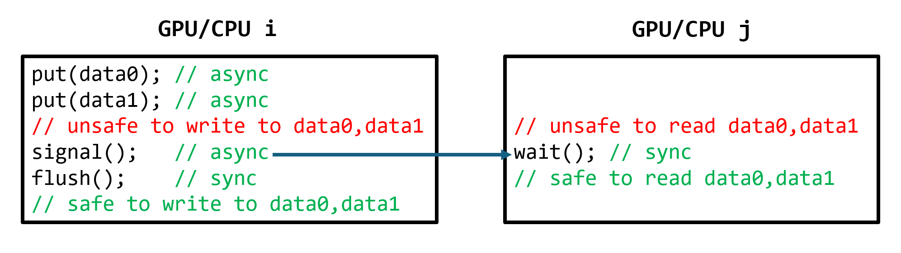
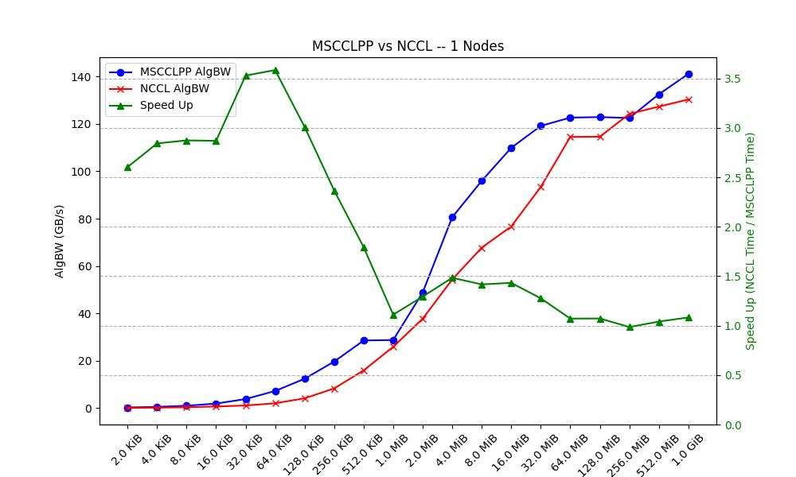
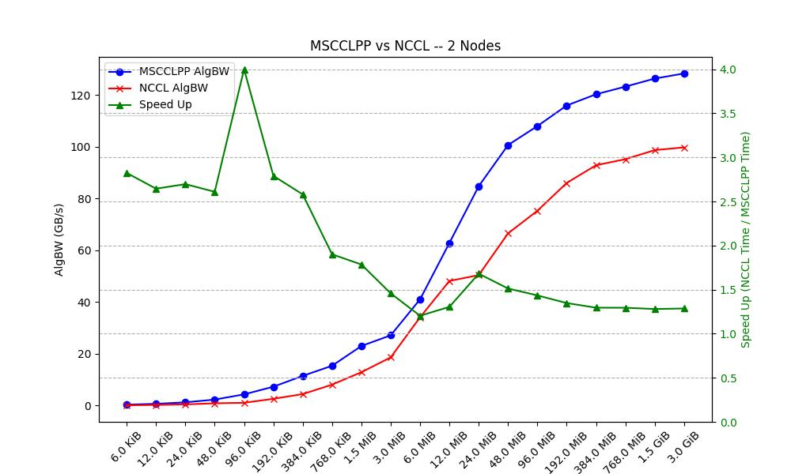

# MSCCL++

[](https://github.com/microsoft/mscclpp/releases/latest)
[](LICENSE)
[](https://github.com/microsoft/mscclpp/actions/workflows/codeql-analysis.yml)

| Pipelines                | Build Status      |
|--------------------------|-------------------|
| Unit Tests (CUDA)        | [](https://dev.azure.com/binyli/HPC/_build/latest?definitionId=4&branchName=main) |
| Integration Tests (CUDA) | [](https://dev.azure.com/binyli/HPC/_build/latest?definitionId=3&branchName=main) |

*NOTE (Nov 2023): Azure pipelines for ROCm will be added soon.*

A GPU-driven communication stack for scalable AI applications.

See [Quick Start](docs/quickstart.md) to quickly get started.

## Overview

MSCCL++ redefines inter-GPU communication interfaces, thereby delivering a highly efficient and customizable communication stack for distributed GPU applications. Its design is specifically tailored to accommodate diverse performance optimization scenarios often encountered in state-of-the-art AI applications. Figure below provides a high-level overview of MSCCL++ abstractions in CUDA, C, and Python.

| <center>MSCCL++ Abstractions Overview |
|-------------------------------|
|  |

The followings highlight the key features of MSCCL++.

* **Light-weight and multi-layer abstractions.** MSCCL++ provides communication abstractions at lowest level close to hardware and at the highest level close to application API. The lowest level of abstraction is ultra light weight which enables a user to implement logics of data movement for a collective operation such as AllReduce inside a GPU kernel extremely efficiently without worrying about memory ordering of different ops. The modularity of MSCCL++ enables a user to construct the building blocks of MSCCL++ in a high level abstraction in Python and feed them to a CUDA kernel in order to facilitate the user's productivity.

* **1-sided 0-copy synchronous and asynchronous abstracts.** MSCCL++ provides fine-grained synchronous and asynchronous 0-copy 1-sided abstracts for communication primitives such as `put()`, `get()`, `signal()`, `flush()`, and `wait()`. The 1-sided abstractions allows a user to asynchronously `put()` their data on the remote GPU as soon as it is ready without requiring the remote side to issue any receive instruction. This enables users to easily implement flexible communication logics, such as overlapping communication with computation, or implementing customized collective communication algorithms without worrying about potential deadlocks. Additionally, the 0-copy capability enables MSCCL++ to directly transfer data between user's buffers without using intermediate internal buffers which saves GPU bandwidth and memory capacity.

* **Unified abstractions for different interconnection hardware.** MSCCL++ provides consistent abstractions regardless of the location of the remote GPU (either on the local node or on a remote node) or the underlying link (either NVLink/xGMI or InfiniBand). This simplifies the code for inter-GPU communication, which is often complex due to memory ordering of GPU/CPU read/writes and therefore, is error-prone.

## Performance

While the power of MSCCL++ is fully realized with application-specific optimization, it still delivers performance benefits even for collective communication operations. The following figures provide a comparison of the AllReduce throughput of MSCCL++ against NCCL 2.19.3. This benchmark was tested over two [Azure NDmv4 SKUs](https://learn.microsoft.com/en-us/azure/virtual-machines/ndm-a100-v4-series) (8 A100-80G GPUs per node).

The key motivation behind these results is scaling of inference for LLM models using tensor parallelism. LLM requests usually are executed in two phases: prompt processing and token sampling. The prompt processing uses a large batch size that is usually equal to a request context length and the corresponding AllReduce size is `len_context*dim_hidden*sizeof(fp16)`. For a context length of 2048 with a hidden dimension of 12288 (GPT-3 size), the AllReduce size is 48MB. The token sampling uses a smaller batch size which corresponds to concurrent user requests in the system and therefore, the AllReduce size is `batch_size*dim_hidden*sizeof(fp16)`. For a concurrency of 16 users, the AllReduce size is 384KB. As the figures below demonstrates, MSCCL++ provides significant speed up over NCCL which is crucial for efficiency of serving LLMs at large scale.

| <center>Single-node AllReduce | <center>Two-node AllReduce |
|-------------------------------|----------------------------|
|  |  |

## Key Concepts

The following highlights key concepts of MSCCL++.

### On-GPU Communication Interfaces: Channels

MSCCL++ provides peer-to-peer communication methods between GPUs. A peer-to-peer connection between two GPUs is called a *Channel*. Channels are constructed by MSCCL++ host-side interfaces and copied to GPUs during initialization. Channels provide *GPU-side interfaces*, which means that all communication methods are defined as a device function to be called from a GPU kernel code. For example, the `put()` method in the following example copies 1KB data from the local GPU to a remote GPU.

```cpp
// `ProxyChannel` will be explained in the following section.
__device__ mscclpp::DeviceHandle<mscclpp::SimpleProxyChannel> channel;
__global__ void gpuKernel() {
  ...
  // Only one thread is needed for this method.
  channel.put(/*dstOffset=*/ 0, /*srcOffset=*/ 0, /*size=*/ 1024);
  ...
}
```

MSCCL++ also provides efficient synchronization methods, `signal()`, `flush()`, and `wait()`. For example, we can implement a simple barrier between two ranks (peer-to-peer connected through `channel`) as follows. Explanation of each method is inlined.

```cpp
// Only one thread is needed for this function.
__device__ void barrier() {
  // Inform the peer GPU that I have arrived at this point.
  channel.signal();
  // Flush the previous signal() call, which will wait for completion of signaling.
  channel.flush();
  // Wait for the peer GPU to call signal().
  channel.wait();
  // Now this thread is synchronized with the remote GPU’s thread.
  // Users may call a local synchronize functions (e.g., __syncthreads())
  // to synchronize other local threads as well with the remote side.
}
```

MSCCL++ provides consistent interfaces, i.e., the above interfaces are used regardless of the location of the remote GPU (either on the local node or on a remote node) or the underlying link (either NVLink/xGMI or InfiniBand).

### ProxyChannel and SmChannel

MSCCL++ delivers two types of channels, **ProxyChannel** and **SmChannel**. `ProxyChannel` provides (R)DMA-based data copy and synchronization methods. When called, these methods send/receive a signal to/from a host-side proxy (hence the name `ProxyChannel`), which will trigger (R)DMA (such as `cudaMemcpy*` or `ibv_post_send`) or issue synchronization methods (such as `cudaStreamSynchronize` or `ibv_poll_cq`). Since the key functionalities are run by the proxy, `ProxyChannel` requires only a single GPU thread to call its methods. See all `ProxyChannel` methods from [here](./include/mscclpp/proxy_channel_device.hpp).

On the other hand, `SmChannel` provides memory-mapping-based copy and synchronization methods. When called, these methods will directly use GPU threads to read/write from/to the remote GPU's memory space. Comparing against `ProxyChannel`, `SmChannel` is especially performant for low-latency scenarios, while it may need many GPU threads to call copying methods at the same time to achieve high copying bandwidth. See all `SmChannel` methods from [here](./include/mscclpp/sm_channel_device.hpp).

### Host-Side Communication Proxy

MSCCL++ provides a default implementation of a host-side proxy for ProxyChannels, which is a background host thread that busy polls triggers from GPUs and conducts functionalities accordingly. For example, the following is a typical host-side code for MSCCL++.

```cpp
// Bootstrap: initialize control-plane connections between all ranks
auto bootstrap = std::make_shared<mscclpp::TcpBootstrap>(rank, world_size);
// Create a communicator for connection setup
mscclpp::Communicator comm(bootstrap);
// Setup connections here using `comm`
...
// Construct the default proxy
mscclpp::ProxyService proxyService();
// Start the proxy
proxyService.startProxy();
// Run the user application, i.e., launch GPU kernels here
...
// Stop the proxy after the application is finished
proxyService.stopProxy();
```

While the default implementation already enables any kinds of communication, MSCCL++ also supports users to easily implement their own customized proxies for further optimization. For example, the following example re-defines how to interpret triggers from GPUs.

```cpp
// Proxy FIFO is obtained from mscclpp::Proxy on the host and copied to the device.
__device__ mscclpp::FifoDeviceHandle fifo;
__global__ void gpuKernel() {
  ...
  // Only one thread is needed for the followings
  mscclpp::ProxyTrigger trigger;
  // Send a custom request: "1"
  trigger.fst = 1;
  fifo.push(trigger);
  // Send a custom request: "2"
  trigger.fst = 2;
  fifo.push(trigger);
  // Send a custom request: "0xdeadbeef"
  trigger.fst = 0xdeadbeef;
  fifo.push(trigger);
  ...
}

// Host-side custom proxy service
class CustomProxyService {
private:
  mscclpp::Proxy proxy_;
public:
  CustomProxyService() : proxy_([&](mscclpp::ProxyTrigger trigger) {
                                  // Custom trigger handler
                                  if (trigger.fst == 1) {
                                    // Handle request "1"
                                  } else if (trigger.fst == 2) {
                                    // Handle request "2"
                                  } else if (trigger.fst == 0xdeadbeef) {
                                    // Handle request "0xdeadbeef"
                                  }
                                },
                                [&]() { /* Empty proxy initializer */ }) {}
  void startProxy() { proxy_.start(); }
  void stopProxy()  { proxy_.stop(); }
};
```

Customized proxies can be used for conducting a series of pre-defined data transfers within only a single trigger from GPU at runtime. This would be more efficient than sending a trigger for each data transfer one by one.

### Python Interfaces

MSCCL++ provides Python bindings and interfaces, which simplifies integration with Python applications.

## Contributing

This project welcomes contributions and suggestions.  Most contributions require you to agree to a
Contributor License Agreement (CLA) declaring that you have the right to, and actually do, grant us
the rights to use your contribution. For details, visit https://cla.opensource.microsoft.com.

When you submit a pull request, a CLA bot will automatically determine whether you need to provide
a CLA and decorate the PR appropriately (e.g., status check, comment). Simply follow the instructions
provided by the bot. You will only need to do this once across all repos using our CLA.

This project has adopted the [Microsoft Open Source Code of Conduct](https://opensource.microsoft.com/codeofconduct/).
For more information see the [Code of Conduct FAQ](https://opensource.microsoft.com/codeofconduct/faq/) or
contact [opencode@microsoft.com](mailto:opencode@microsoft.com) with any additional questions or comments.

## Trademarks

This project may contain trademarks or logos for projects, products, or services. Authorized use of Microsoft
trademarks or logos is subject to and must follow
[Microsoft's Trademark & Brand Guidelines](https://www.microsoft.com/en-us/legal/intellectualproperty/trademarks/usage/general).
Use of Microsoft trademarks or logos in modified versions of this project must not cause confusion or imply Microsoft sponsorship.
Any use of third-party trademarks or logos are subject to those third-party's policies.
