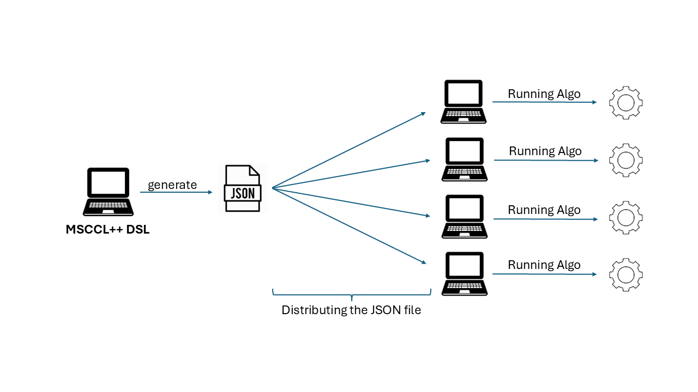

# MSCCL++ DSL Json File
The MSCCL++ DSL is used to define a JSON file that describes the structure and behavior of a collective communication algorithm. It contains a detailed specification of the operations involved and must be distributed to all participating machines. Once distributed, the MSCCL++ executor can be triggered to use this JSON file to generate an execution plan and run the algorithm.



The generic structure of the JSON file consist of the following fields:

- ```name```: The name of the algorithm. This is useful when you want to define multiple algorithms for the same collective operation (e.g., two different allreduce algorithms). The name helps distinguish and store two different execution plan and context for them.
- ```collective```: Specifies the type of collective operation. Supported values include: ```allreduce```, ```allgather```, ```reducescatter```, ```broadcast```, and ```alltoall```.
- ```protocol```: Defines how the data is stored and transferred. It can be either Simple or LL (Low Latency). In the LL case, data is stored with flags to avoid signal-based synchronization and uses a scratch buffer as an intermediate storage format.
- ```inplace```: A boolean flag indicating whether the algorithm operates in-place or out-of-place.
- ```gpus```: Describes the GPU-specific configuration and the operations executed on each GPU. This will be detailed in the following sections.
- ```num_threads_per_block```: Specifies the number of threads per thread block. Typical values include 256, 512, 768, or 1024, depending on performance requirements.
- ```use_double_scratch_buffer```: A boolean flag that enables to double the scratch buffer. When set to true, the scratch buffer double the size and is logically divided into two halves. This allows alternating executions of the same algorithm to use different halves of the buffer, for instance, odd-numbered executions use the first half, and even-numbered executions use the second. This strategy helps avoid memory conflicts when the same algorithm is invoked multiple times.
- ```min_message_size```: The minimum message size supported by this algorithm. If the message is smaller than this value, the algorithm will not be selected for execution.
- ```max_message_size```: The maximum message size supported by this algorithm. If the message exceeds this value, the algorithm will not be selected for execution.

Example:

```json
{
  "name": "reducescatter",
  "collective": "reducescatter",
  "protocol": "Simple",
  "inplace": true,
  "gpus": [...],
  "num_threads_per_block": 1024,
  "use_double_scratch_buffer": false,
  "min_message_size": 0,
  "max_message_size": 18446744073709551615
}
```

## GPU
The gpus field is the core of the JSON file, containing the detailed configuration of the collective algorithm for each GPU. It is defined as a list, where each element describes the setup for a specific GPU. Each GPU entry includes the following fields:

- ```id```: The identifier of the GPU.
- ```inputChunks```: The number of chunks in the input buffer.
- ```outputChunks```: The number of chunks in the output buffer.
- ```scratchChunks```: The number of chunks in the scratch buffer.
- ```threadblocks```: A list describing all operations assigned to each thread block. Each entry defines how a thread block participates in the collective operation.
- ```channels```: A list of communication channels, where each element describes a channel.
- ```remoteBuffers```: A list with all the remote buffers used for that GPU on the algorithm.
- ```bufferAlignment```: The requirement that a buffer's memory address must be a multiple of a specific number of bytes.

Example:

```json
"gpus": [
    {
      "id": 0,
      "inputChunks": 1,
      "outputChunks": 2,
      "scratchChunks": 0,
      "threadblocks": [...],
      "channels": [...],
      "remoteBuffers": [...],
      "bufferAlignment": 4
    }
]
```

### Channels
The channel field describes the characteristics of the channels. Basically, we have three types of channels:

- Memory Channel: A MemoryChannel wraps data transfer methods that use thread-copy mechanism, ie., directly use GPU threads for writing to peer GPUs memory.
- Port Channel: A PortChannel implements primitives when data transfer is done over ports connected to GPU memory, such as cudaMemcpy for intra-node DMA or ibv_post_send for RDMA. 
- Switch Channel: A SwitchChannel provides primitives for performing collective operations among GPUs. These operations usually require specialized hardware sup-
port.

The Memory Channel has the following fields:
- ```type```: Specifies the type of the channel, which in the case of the Memory Channel, will be ```memory```.
- ```connectedTo```: Specifies the connections between channels. For example, if we have a list like: [1, 2, 3], it indicates that there are three channels: the first is connected to rank 1, the second to rank 2, and the third to rank 3.

Example:

```json
"channels": [
  {
    "type": "memory",
    "connectedTo": [
      1,
      2,
      3
    ]
  }
]
```

The Port Channel has the following fields:
- ```type```: Specifies the type of the channel, which in the case of the Memory Channel, will be ```port```.
- ```connectedTo```: Specifies the connections between channels. For example, if we have a list like: [1, 2, 3], it indicates that there are three channels: the first is connected to rank 1, the second to rank 2, and the third to rank 3.

Example:

```json
"channels": [
  {
    "type": "port",
    "connectedTo": [
      1,
      2,
      3
    ]
  }
]
```

The Switch Channel has the following fields:
- ```type```: Specifies the type of the channel, which in the case of the Memory Channel, will be ```switch```.
- ```buff```: Consist of the buffer type which the Switch Channel will be binded, this could have the following values: "i" for the input buffer, "o" for the output buffer, "s" for the scratch buffer.
- ```rankGroups```: Consist of the group of the ranks connected by the Switch Channel, this field contains the size and the list of the ranks connected.

Example:

```json
"channels": [
  {
    "type": "switch",
    "buff": "i",
    "rankGroups": [
      {
        "size": 8,
        "ranks": [
          0,
          1,
          2,
          3,
          4,
          5,
          6,
          7
        ]
      }
    ]
  }
]
```

### Remote Buffers
The ```remoteBuffers``` field describes all the remote buffers that a given GPU needs to access. Each entry in this list contains the following fields:

- ```rank``:  Indicates the rank that owns the remote buffer.
- ```type```: Consist of the buffer type, this could have the following values: "i" for the input buffer, "o" for the output buffer, "s" for the scratch buffer.
- ```infoLocation```: Depending on where the information is stored and where it needs to be accessed, the data may be transferred accordingly.

Example

```json
"remoteBuffers": [
  {
    "rank": 1,
    "type": "i",
    "infoLocation": "gpu"
  }
]
```

### Thread Blocks
The thread block field describe the operation inside each thread block, we have the following fields:

- ```id```: The thread block id.
- ```ops```: The list with all the operation in order they will be executed by this tread block.
- ```channels```: The channels the thread block will use, referenced by the channel id. The channel id is based on the global channel description in the gpu, for example if the channel type is memory and the channel id is 0, it refers to the first channel of memory id type descriptioned in the gpu channels field.
- ```remoteBuffersIds```: A list with all the remote buffer ids(related to the remove buffer field on the GPU) used by the thread block.

For Example:

```json
"threadblocks": [
  {
    "id": 0,
    "ops": [...],
    "channels":[
      {
        "ctype": "memory",
        "cids": [
          0
        ]
      }
    ],
    "remoteBuffersIds": [
      0
    ]
  }
]
```

The most important field here is the ops fields, where there is the description for all the operations, each operation has specific fields, let's given an overview in all the possible fields and after this go through each of them:

TO BE DEFINED

#### Signal Operation
The signal operation is composed by the field ```name```, ```cids```, ```ctype```.

Example

```json
"ops": [
  {
    "name": "signal",
    "cids": [
      0
    ],
    "ctype": "memory",
  }
]
```

### Wait Operation
The signal operation is composed by the field ```name```, ```cids```, ```ctype```.

```json
"ops": [
  {
    "name": "wait",
    "cids": [
      0
    ],
    "ctype": "memory",
  }
]
```

### Put Operation
The put operation is composed by the field ```name```, ```src_buff```, ```dst_buff```, ```cids```, ```ctype```.

```json
"ops": [
  {
    "name": "put",
    "src_buff": [
      {
        "type": "i",
        "offset": 0,
        "size": 1
      
      }
    ],
    "dst_buff": [
      {
        "buff_id": 0,
        "offset": 0,
        "size": 1
      }
    ],
    "cids": [
      0
    ],
    "ctype": "memory"
  }
]
```

### The json field for device semaphore
```json
{
    "name": "sem_acquire",
    "sync": "after",
    "id": 0,
}
```

## Examples

in place AllGather two Nodes:

```python
size = 2

for src_rank in range(size):
  rank = Rank(src_rank)
  src_input_buffer = rank.get_input_buffer()
  src_chunk = input_buffer[src_rank:src_rank + 1] 
  for dst_rank in range(size):
    rank = Rank(dst_rank)
    dst_input_buffer = rank.get_input_buffer()
    dst_chunk = input_buffer[src_rank:src_rank + 1] 
    if src_rank != dst_rank:
      channel = Channel(dst_rank, src_rank, channel_type)
      channel.relaxedSignal(tb=0, sync=None)
      channel.relaxedWait(tb=0, sync="after")
      channel.put(dst_chunk, src_chunk, tb=0)
      channel.signal(tb=0, sync="before")
      channel.wait(tb=0, sync="after")
```

For this example we will have the following JSON file:

```json
{
  "name": "allgather",
  "collective": "allgather",
  "protocol": "Simple",
  "inplace": true,
  "gpus": [
    {
      "id": 0,
      "inputChunks": 1,
      "outputChunks": 2,
      "scratchChunks": 0,
      "threadblocks": [
        {
          "id": 0,
          "ops": [
            {
              "name": "rsignal",
              "cids": [
                0
              ],
              "ctype": "memory",
            },
            {
              "name": "rwait",
              "cids": [
                {
                  "id": 0
                }
              ],
              "ctype": "memory",
            },
            {
              "name": "put",
              "src_buff": [
                {
                  "offset": 0,
                  "type": "i",
                  "size": 1
                
                }
              ],
              "dst_buff": [
                {
                  "buff_id": 0,
                  "offset": 0,
                  "size": 1
                }
              ],
              "cids": [
                0
              ],
              "ctype": "memory"
            },
            {
              "name": "signal",
              "cids": [
                0
              ],
              "ctype": "memory",
            },
            {
              "name": "wait",
              "cids": [
                0
              ],
              "ctype": "memory",
            }
          ],
          "channels":[
            {
              "ctype": "memory",
              "cids": [
                0
              ]
            }
          ],
          "remoteBuffersIds": [
            0
          ]
        }
      ],
      "channels": [
        {
          "type": "memory",
          "connectedTo": [
            1
          ]
        }
      ],
      "remoteBuffers": [
        {
          "rank": 1,
          "type": "i",
          "infoLocation": "gpu"
        }
      ]
    },
    {
      "id": 1,
      "inputChunks": 1,
      "outputChunks": 2,
      "scratchChunks": 0,
      "threadblocks": [
        {
          "id": 0,
          "ops": [
            {
              "name": "rsignal",
              "cids": [
                0
              ],
              "ctype": "memory",
            },
            {
              "name": "rwait",
              "cids": [
                {
                  "id": 0
                }
              ],
              "ctype": "memory",
            },
            {
              "name": "put",
              "src_buff": [
                {
                  "type": "i",
                  "offset": 1,
                  "size": 1
                
                }
              ],
              "dst_buff": [
                {
                  "buff_id": 0,
                  "offset": 1,
                  "size": 1
                }
              ],
              "cids": [
                0
              ],
              "ctype": "memory"
            },
            {
              "name": "signal",
              "cids": [
                0
              ],
              "ctype": "memory",
            },
            {
              "name": "wait",
              "cids": [
                0
              ],
              "ctype": "memory",
            }
          ],
          "channels":[
            {
              "ctype": "memory",
              "cids": [
                0
              ]
            }
          ],
          "remoteBuffersIds": [
            0
          ]
        }
      ],
      "channels": [
        {
          "type": "memory",
          "connectedTo": [
            0
          ]
        }
      ],
      "remoteBuffers": [
        {
          "rank": 0,
          "type": "i",
          "infoLocation": "gpu"
        }
      ]
    }
  ]
}
```

### The json field for pipeline loop
The pipeline loop is used to overlap the operations. The pipeline loop will be used to construct the execution plan for the MSCCL++ runtime. 
```json
"threadblocks": [
{
    "id": 0,
    "ops": [
        {
            "name": "pipeline_loop",
            "iter_context": {
                "unit": 2**20,
                "num_chunks": 1,
            },
            "ops": [
                {
                    "name": "copy",
                    "src_buffer": {
                        "buffer_ref": -1,
                        "offset": 0,
                        "buffer": "i",
                    },
                    "dst_buffer": {
                        "buffer_ref": -1,
                        "buffer": "s",
                        "offset": 0,
                    },
                    "count": 1,
                    "tb_groups": [...], // User multi-thread to handle same buffer, maybe no needed at this time
                },
                {
                    "name": "sem_release",
                    "sync": "before",
                    "id": 0,
                }
            ]
        }
    ]
},
{
    "id": 1,
    "ops": [
        {
            "name": "pipeline_loop",
            "iter_context": {
                "unit": 2**20,
                "num_chunks": 1,
            },
            "ops": [
                {
                    "name": "sem_acquire",
                    "sync": "after",
                    "id": 0,
                },
                {
                    "name": "put",
                    "src_chunk": {
                        "buffer_ref": -1,
                        "buffer": "s",
                        "offset": 0,
                    },
                    "dst_chunk": {
                        "buffer_ref": 0,
                        "buffer": "s",
                        "offset": 0,
                    },
                    "count": 1,
                    "channel_id": 0,
                }
            ]
        }
    ],
    "channels": [
        {
            "id": 0,
            "type": "memory",
        }
    ]
}]
```