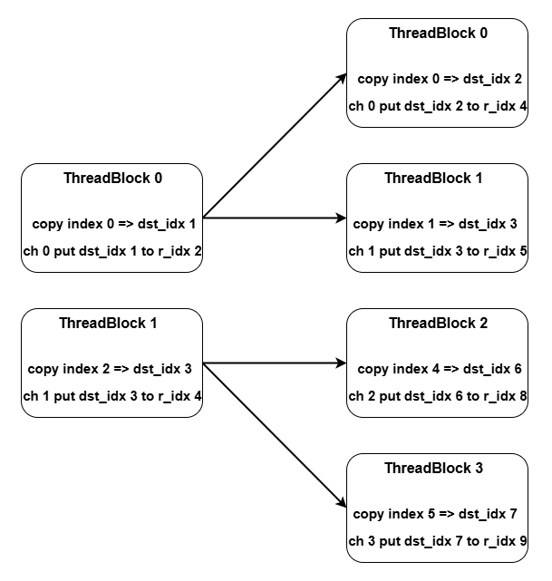
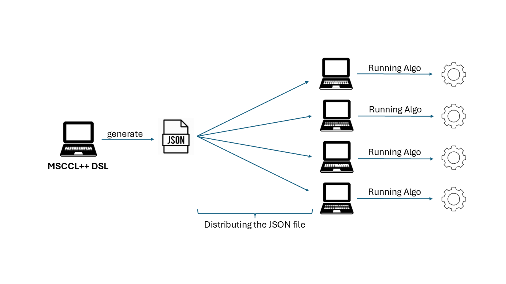

# MSCCL++ DSL
## Introduction

The MSCCL++ Domain-Specific Language (DSL) provides a Python-native API for defining and executing GPU-based communication collective. With a few high-level calls, users can construct complex data movement and synchronization workflows without dealing with low-level CUDA code.

Here is the highlights of the MSCCL++ DSL:
- **Fine-grained Python-native API**: MSCCL++ DSL provides a Pythonic, fine-grained API for defining and executing GPU-based communication collectives. Users can construct complex data movement and synchronization workflows without writing low-level CUDA code, while still achieving performance comparable to hand-tuned CUDA implementations.

- **Effortless performance tuning**:  The MSCCL++ DSL analyzes data dependencies and synchronization patterns to automatically fuse operations to eliminate data movement overhead, while instance counts can be manually configured to boost performance.

- **Flexible execution model**: The MSCCL++ DSL allows users to load different execution plans at runtime, enabling dynamic optimization based on the current workload and hardware configuration.


## MSCCL++ DSL Concepts

### Collectives

Collectives define the communication pattern for distributed operations such as AllReduce, AllGather, and ReduceScatter. The input and output buffers are predefined based on the collective type and parameters. The number of chunks in each buffer is determined by the `chunk_factor` parameter multiplied by `num_ranks` where appropriate. For example, AllReduce uses `num_ranks * chunk_factor` chunks for both input and output, while AllGather uses `chunk_factor` input chunks and `num_ranks * chunk_factor` output chunks per rank.


### Buffer/Chunk
Buffer is a data structure that holds the data to be sent or received. The input/output buffer is predefined based on communication patterns. User can allocate scratch buffer for intermediate data movement. Chunk is a slice of the buffer.

```python
rank = Rank(rank_id)
input_buffer = rank.get_input_buffer()
dst_chunk = input_buffer[0:1]
src_chunk = input_buffer[1:2]
rank.copy(dst_chunk, src_chunk, tb=0)
rank.reduce(dst_chunk, src_chunk, op=ReduceOperationType.sum, tb=0)
```

### Channel
User need to use channel to communicate between ranks. Now we have three types of channels: memoryChannel, portChannel and switchChannel.
- **MemoryChannel**: Uses peer-to-peer memory access to communicate between GPUs.
- **PortChannel**: Uses interconnection ports to communicate between GPUs.
- **SwitchChannel**: Uses interconnection-switch-enabled multimem memory access to communicate between GPUs.

**Note:** Each time call channel will created a new one. If user want to reuse the channel, please keep the channel object.

Here is the example for two ranks synchronization with each others.
```python
nranks = 2
for i in range(nranks):
    src_rank = i
    dst_rank = (i + 1) % nranks
    channel = MemoryChannel(dst_rank, src_rank)
    channel.signal(tb=0, data_sync=SyncType.none)
    channel.wait(tb=0, data_sync=SyncType.after)
```

#### For switch channel
Switch channel associates a group of buffers from a specified set of ranks. All operations invoked on the channel will be applied to those buffers.

Example for two ranks allreduce via switch channel.
```python
# Creating Channels
switch_chan = SwitchChannel(rank_list=[gpu for gpu in range(gpu_size)], buffer_type=BufferType.input)
for gpu in range(gpu_size):
    buffer_offset = gpu
    rank = Rank(gpu)
    input_buffer = rank.get_input_buffer()
    switch_chan.at_rank(gpu).reduce(buffer_offset, size=1, dst_chunk=input_buffer[gpu : gpu + 1], tb=0)
    switch_chan.at_rank(gpu).broadcast(input_buffer[gpu : gpu + 1], buffer_offset, size=1, tb=0)
```

### Synchronization
We provide some synchronization primitives to sync threadblocks inside a rank. The synchronization is done through a barrier or semaphore. The barrier is used to synchronize a set of thread blocks in the rank, while the semaphore allows asynchronous signaling and waiting between thread blocks.

```python
rank = Rank(0)
rank.barrier([0, 1])
sem = Semaphore(rank=0, initial_value=1)
sem.acquire(tb=0, data_sync=SyncType.after)
sem.release(tb=0, data_sync=SyncType.before)
```

The synchronization inside the thread-block can be inferred by MSCCL++ DSL automatically. Which mean if we have data dependence between two operations, we will insert a synchronization point between them. 

But for multi-thread-blocks synchronization and cross ranks synchronization, we need to insert the synchronization point manually.


## Kernel fusion
MSCCL++ DSL performs kernel fusion by analyzing all operations scheduled within the same thread‐block. For each thread‐block, the DSL builds a directed acyclic graph (DAG) of chunk‐level operations and tracks data dependencies and usage patterns. When two or more operations meet fusion criteria—such as contiguous chunk access, no intervening dependencies, and compatible resource requirements—the DSL merges them into a single GPU kernel function. This fusion strategy reduces launch overhead and memory traffic, resulting in more efficient execution.

For example:

```python
# Reduce operation followed by put operation
rank.reduce(dst_chunk, src_chunk, op=ReduceOperationType.sum, tb=0)
channel.put(remote_chunk, dst_chunk, tb=0)
```

When the DSL detects that a reduce operation is immediately followed by a put operation using the same data chunk, it automatically fuses them into a single operation internally, eliminating intermediate memory writes and improving performance.

## Data dependencies analysis

The MSCCL++ DSL automatically tracks data dependencies at the chunk level within each thread block by maintaining the last writer and active readers for each memory slot. When operations have data dependencies, the DSL automatically inserts necessary synchronization points to ensure correct execution order. Additionally, the system analyzes the dependency graph to remove redundant synchronization operations (such as unnecessary barriers) when the execution order already guarantees correctness, optimizing performance while maintaining safety.

For example:

```python
# Within the same thread block - copy then put dependency
rank.copy(dst_chunk, src_chunk, tb=0)
channel.put(remote_chunk, dst_chunk, tb=0)  # Same tb reads from dst_chunk
```

The DSL automatically inserts a `nop` operation to synchronize within the thread block:

```python
rank.copy(dst_chunk, src_chunk, tb=0)
rank.nop(tb=0)  # Inserted for intra-block synchronization, nop is an internal operation, hidden from users
channel.put(remote_chunk, dst_chunk, tb=0)
```


## Pipeline Loop
Pipeline enables overlapping operations across thread blocks. Using Semaphore for cross-block synchronization, it overlaps stages—such as copying data from the input buffer to a scratch buffer—with subsequent peer transfers. A pipelined loop orchestrates these stages to run concurrently, maximizing overall throughput.

This example demonstrates a pipelined loop that copies data from an input buffer to a scratch buffer, then transfers it to other peers. The `Semaphore` is used to synchronize the two stages. `unit` specifies the size of each chunk, and `num_chunks` indicates how many chunks will be processed in the loop.

```python
sem = Semaphore(rank=rank, initial_value=0)
rank = Rank(rank)
channel = MemoryChannel(dst_rank, src_rank)
with LoopIterationContext(unit=2**20, num_chunks=1):
    # The dst_chunk and src_chunk sizes should match the num_chunks parameter in the loop context.
    rank.copy(dst_chunk, src_chunk, tb=0)
    sem.release(tb=0)
    sem.acquire(tb=1)
    channel.put(other_peer_chunk, dst_chunk, tb=1)
``` 


Here is the example for two ranks allreduce. Which achieve non-zero copy and use nvls. We use 3 thread-blocks to do the allreduce.
The first thread-block is used to copy data from input buffer to scratch buffer, the second thread-block is used to do allreduce in scratch buffer, and the third thread-block is used to copy data from scratch buffer to output buffer.  The thread-blocks are synchronized by semaphores.
```python
nvls_chan = SwitchChannel(rank_list=[0, 1], buffer_type=BufferType.scratch)
scratch_buffer = []
for i in range(nranks):
    scratch_buffer.append(Buffer(i, nranks))

for i in range(nranks):
    src_rank = i
    dst_rank = (i + 1) % nranks
    chan = MemoryChannel(dst_rank, src_rank)
    chan1 = MemoryChannel(dst_rank, src_rank)
    rank = Rank(i)
    sem0 = Semaphore(rank=i, initial_value=0)
    sem1 = Semaphore(rank=i, initial_value=0)
    input_buffer = rank.get_input_buffer()
    output_buffer = rank.get_output_buffer()

    # Define loop iteration context for processing data chunks
    with LoopIterationContext(unit=2**20, num_chunks=1):
        # Copy input data to scratch buffers
        for offset in range(nranks):
            dst_chunk = scratch_buffer[i][offset : offset + 1]
            src_chunk = input_buffer[offset : offset + 1]
            rank.copy(dst_chunk, src_chunk, tb=0)

        # Synchronize with other ranks
        chan.signal(tb=0, data_sync=SyncType.before)
        chan.wait(tb=0, data_sync=SyncType.after)
        sem0.release(tb=0)  # Release semaphore to allow next step to proceed

        # Wait for previous step completion
        sem0.acquire(tb=1, data_sync=SyncType.after)

        # Reduce operation: combine data from multiple ranks into local chunk
        nvls_chan.at_rank(src_rank).reduce(
            buffer_offset=i, size=1, dst_chunk=scratch_buffer[i][i : i + 1], tb=1
        )

        # Broadcast the reduced result to all participating ranks
        nvls_chan.at_rank(src_rank).broadcast(
            src_chunk=scratch_buffer[i][i : i + 1], buffer_offset=i, size=1, tb=1
        )

        # Signal completion of reduction stage and prepare for next stage
        chan1.signal(tb=1, data_sync=SyncType.before)
        sem1.release(tb=1)

        # Wait for previous stage completion
        sem1.acquire(tb=2)
        chan1.wait(tb=2, data_sync=SyncType.after)

        # Copy all reduced chunks from scratch buffer to final output buffer
        for index in range(nranks):
            dst_chunk = output_buffer[index : index + 1]
            src_chunk = scratch_buffer[i][index : index + 1]
            rank.copy(dst_chunk, src_chunk, tb=2)
```

## Adjust the number of instances

The MSCCL++ DSL supports replicating algorithm instances to increase parallelism and improve performance. When `instances > 1` is specified in `MSCCLPPProgram`, the DSL automatically replicates thread blocks, channels, and buffer chunks across multiple instances. Each instance operates on separate data partitions, allowing concurrent execution of the same algorithm pattern. The replication uses configurable policies: interleaved (default) distributes data chunks across instances in round-robin fashion, while other policies can control how channels and thread block IDs are mapped. This feature is particularly useful for scaling algorithms across larger data sizes or increasing GPU utilization.

For example:
```python
# Create program with 2 instances for increased parallelism
program = MSCCLPPProgram(
    name="allreduce_2x", 
    collective=AllReduce(num_ranks=8, chunk_factor=1),
    num_ranks=8,
    instances=2  # Replicate algorithm 2 times
)
```

The following figure shows how thread blocks and channels are replicated across multiple instances. Each instance operates on separate data chunks, with thread block IDs and channel mappings automatically adjusted by the DSL to avoid conflicts:




## Execution plan

The MSCCL++ DSL generates an execution plan in JSON format, describing the operations to be executed on each rank. The execution plan contains details about buffers, channels, and synchronization points, and is distributed to all participating machines. Once distributed, the MSCCL++ executor can use this JSON file to run the algorithm.

Following picture shows the overall workflow for generating and distributing the execution plan:


## All2All support
Currently, the DSL only supports the static all2all algorithm. To support all2allv, we need to obtain the send/receive sizes at runtime. This may require using placeholders in the JSON execution plan, which would be replaced with the actual sizes during execution. If we can make the chunk size variable, the same approach could be used to support all2allv.
